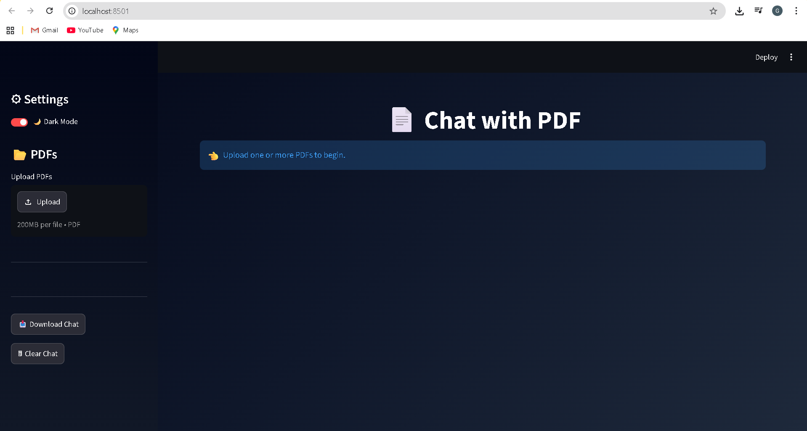
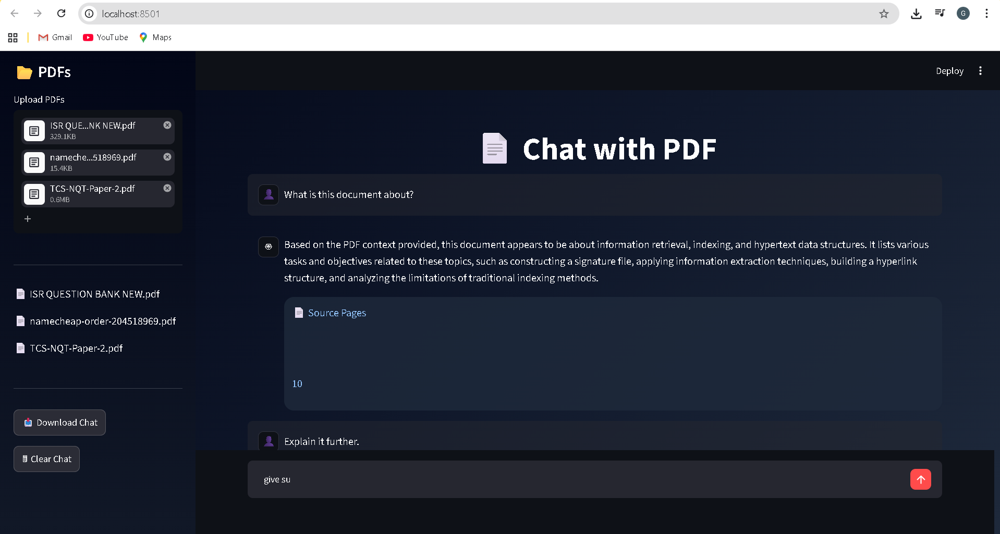

# 📄 AI-Powered Multi-PDF Chat Assistant

An AI-powered document question-answering application built using Retrieval-Augmented Generation (RAG), FAISS, HuggingFace Embeddings, and Groq Llama 3.1.

---

## ✨ Features

* 📄 Multiple PDF Support
* 🤖 Groq Llama 3.1 Integration
* 🔍 Semantic Search with FAISS
* 🧠 Conversation Memory
* ⚡ Streaming Responses
* 📚 Source Page Citations
* 🌙 Dark / Light Mode
* 💎 Premium UI
* 📥 Download Conversation
* 👤 Real Avatars

---

## 🛠 Tech Stack

* Python
* Streamlit
* LangChain Community
* FAISS
* HuggingFace Embeddings
* Groq API
* Llama 3.1 8B Instant

---

## 🏗 Architecture

```text
PDF
↓
PyPDFLoader
↓
Chunking
↓
Embeddings
↓
FAISS
↓
Retriever
↓
Groq Llama 3.1
↓
Answer + Sources
```

---

## 🖼 Home Page



---

## 📂 Upload PDF


---

## 🤖 Answer Generation



---

## 🚀 Installation

```bash
git clone <your-repo-url>

cd chat-with-pdf

pip install -r requirements.txt

python -m streamlit run app.py
```

---

## ⭐ Project

**AI-Powered Multi-PDF Chat Assistant Using RAG, FAISS and Groq**

Built with ❤️ using Python and Streamlit.
